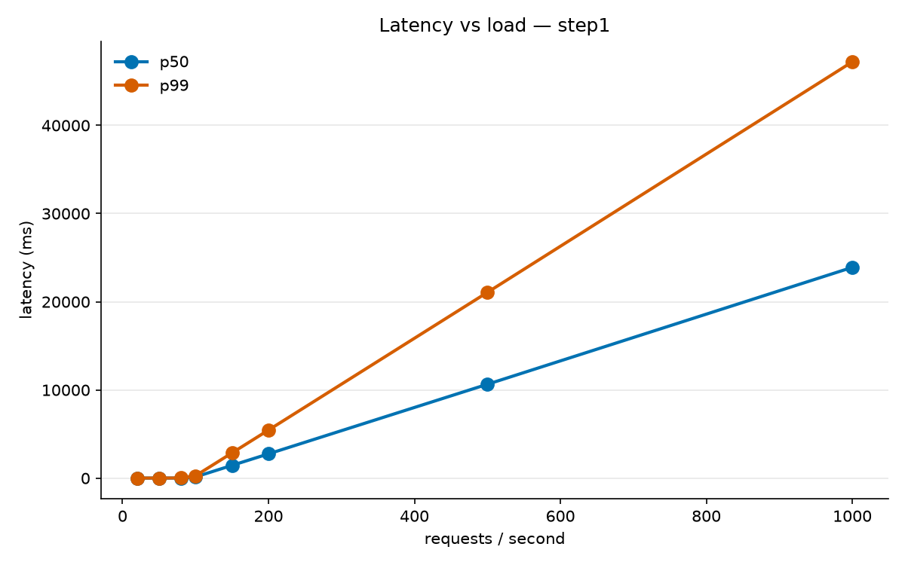
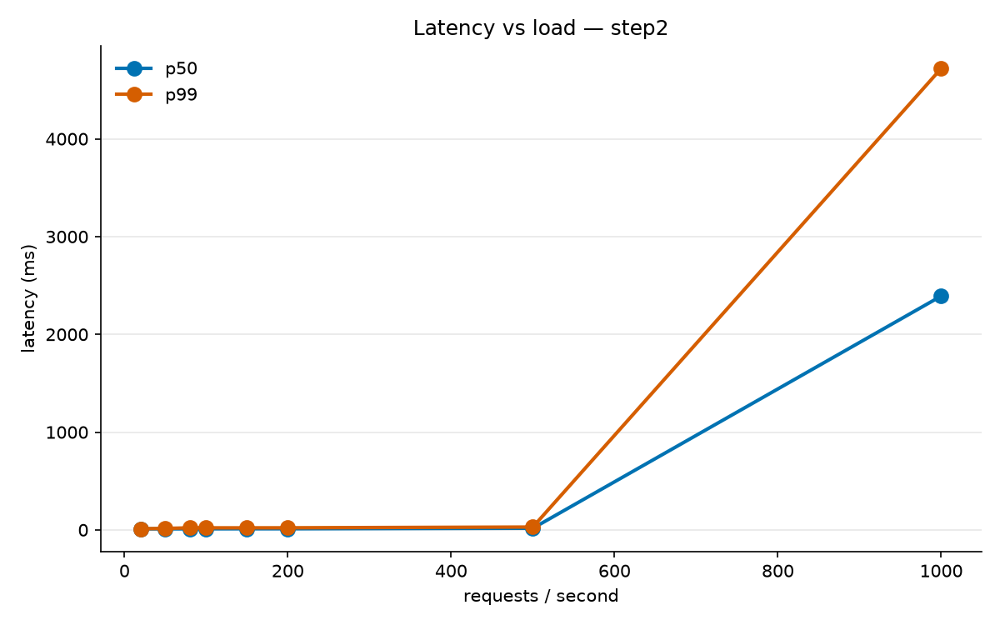
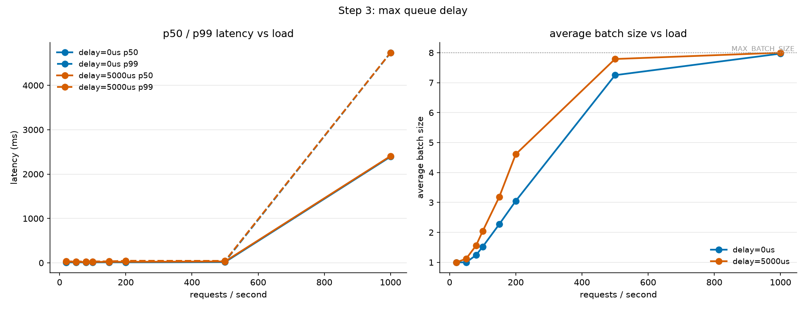
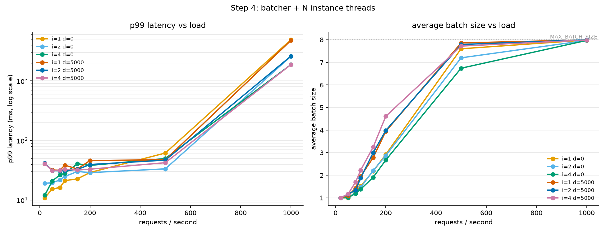

# mini-batcher

A small, single-file C++17 rebuild of the **dynamic batcher** from NVIDIA
Triton Inference Server, written to learn how it works.

A load generator sends requests at a fixed rate. The batcher groups them into
batches and hands each batch to one of N "model instance" threads, which run a
fake model that simulates GPU cost. At the end of each run the program checks
that no request was dropped or run twice, and prints latency percentiles, the
average batch size and instance utilization.

The project was built in four steps. Each step is a commit, and the `STEP 1-4`
comments at the top of `main.cpp` follow the same order. Benchmark data and
plots for every step are in [`results/`](results/).

> For the full design (thread ownership, lock discipline, shutdown order, the
> contention model's limits, the mapping to Triton source and the
> ThreadSanitizer runs), see **[DESIGN.md](DESIGN.md)**. This README covers
> what the project is, how to build and run it, and what the benchmarks show.

---

## Contents

- [Architecture](#architecture)
- [The fake model](#the-fake-model)
- [Build](#build)
- [Run](#run)
- [Benchmarking and plotting](#benchmarking-and-plotting)
- [The four steps and their results](#the-four-steps-and-their-results)
- [Correctness checks](#correctness-checks)
- [Mapping to Triton](#mapping-to-triton)
- [Repository layout](#repository-layout)
- [Limitations](#limitations)

---

## Architecture

```
LoadGenerator --> [RequestQueue] --> BatcherThread --> [BatchQueue] --> InstanceThread x N
   (producer)      mutex+cv+deque      (forms batches)   mutex+cv+deque      (runs the model)
```

| Component | Role |
|---|---|
| `LoadGenerator` | Sends `rps` requests per second for `seconds` seconds. Sends are scheduled against absolute times (`sleep_until`), so timing drift doesn't add up over the run. Each `Request` has an id, an input vector, an enqueue timestamp and a completion callback. |
| `RequestQueue` | A `mutex`, a `condition_variable` and a `deque` of requests, plus a shutdown flag. |
| `BatcherThread` | First waits until an instance is idle. Then calls `FormBatch`, which returns a batch when either **(a)** `MAX_BATCH_SIZE` (8) requests are queued, **(b)** the oldest request has waited `delay_us`, or **(c)** shutdown has started. Pushes the batch onto the `BatchQueue`. |
| `BatchQueue` | The second queue. It also keeps an `idle_instances` count that the batcher uses to reserve an instance before dispatching. |
| `InstanceThread` × N | Takes a batch, calls `RunModel`, and fires each request's callback. |
| `Stats` | Latencies (protected by a mutex) and atomic counters, used for the final report. |

Design choices worth knowing about (each is explained in DESIGN.md):

- **The batcher waits for an idle instance *before* building a batch.** In the
  meantime, requests keep piling up in the queue, so batches are formed as late
  and as large as possible. This mirrors Triton's
  `RateLimiter::WaitForPayloadSlotAvailable`.
- **The timed wait uses a computed timeout, not a polling interval.**
  `FormBatch` calls `cv.wait_for(remaining)`, where `remaining` is the time
  until the oldest request hits its deadline. After any wakeup (timeout,
  notify or spurious) it re-checks everything from scratch.
- **The batcher never holds both queue locks at once.** It is the only thread
  that uses both queues, so there is no lock ordering to get wrong.
- **Shutdown doesn't drop requests.** Once the producer stops, the batcher
  ignores the delay and dispatches immediately. Instances keep draining the
  batch queue until it is empty *and* shutdown is set.

## The fake model

`RunModel` stands in for a GPU:

```
base_cost = 10 ms + 0.5 ms × batch_size      // batching is almost free per item
active    = number of instances inside RunModel at call start
cost      = base_cost × (1 + contention × (active − 1))
```

- A batch of 8 costs 14 ms, while 8 separate calls cost 84 ms. That gap is
  why batching helps.
- The **contention** term models instances sharing one GPU. Adding instances
  raises throughput, but by less each time, and every call gets slower. With
  the default `contention = 0.7`, 4 busy instances each run 3.1× slower than
  one instance alone.
- Timing uses a sleep followed by a short spin: it sleeps until about 12 ms
  before the deadline, then spins. This gives sub-millisecond accuracy on
  Windows, where sleeps are coarse. Windows also runs with
  `timeBeginPeriod(1)` via an RAII guard.

## Build

You need a C++17 compiler with `std::thread` support.

**Windows (MinGW g++)** — the main target; `-lwinmm` is required for `timeBeginPeriod`:

```powershell
g++ -std=c++17 -O2 -pthread main.cpp -o mini_batcher.exe -lwinmm
```

**Linux / WSL / macOS:**

```bash
g++ -std=c++17 -O2 -pthread main.cpp -o mini_batcher
```

**ThreadSanitizer build** (Linux/WSL; MinGW doesn't ship TSan):

```bash
g++ -std=c++17 -O1 -g -fsanitize=thread -pthread main.cpp -o mini_batcher_tsan
# On WSL2 the TSan runtime may fail with "unexpected memory mapping"; disable ASLR:
setarch $(uname -m) -R ./mini_batcher_tsan 300 5 4 5000
```

## Run

```
mini_batcher <rps> <seconds> [instances=1] [delay_us=5000] [contention=0.7]
```

| Arg | Default | Meaning |
|---|---|---|
| `rps` | 50 | Requests per second from the load generator |
| `seconds` | 3 | How long to send requests (the run lasts longer while in-flight work drains) |
| `instances` | 1 | Number of model instance threads (Triton's `instance_group[].count`) |
| `delay_us` | 5000 | Longest a request waits for its batch to fill (Triton's `max_queue_delay_microseconds`). `0` means dispatch as soon as an instance is free |
| `contention` | 0.7 | How much concurrent instances slow each other down. `0` means perfect scaling |

`MAX_BATCH_SIZE` is a compile-time constant (`8`) in `main.cpp`.

Example:

```powershell
.\mini_batcher.exe 200 5 2 5000 0.7
```

```
rps=200 completed=1000 sent=1000  avg=23.2ms  p50=23.3ms  p99=39.5ms  max=43.7ms  runmodel_calls=251  avg_batch=3.98  busy_pct=31.4  instances=2 delay_us=5000 contention=0.70
```

Output fields:

- `completed` / `sent`: these should always be equal. If not, an error goes to stderr.
- `avg`, `p50`, `p99`, `max`: time from enqueue to callback for each request, in ms.
- `runmodel_calls`, `avg_batch`: how many batches ran and how full they were on average.
- `busy_pct`: time spent inside `RunModel` divided by (wall time × instances).
  100% means every instance was busy for the whole run.

## Benchmarking and plotting

`scripts/benchmark.ps1` runs the binary at 20, 50, 80, 100, 150, 200, 500
and 1000 rps and saves the parsed summary lines to a CSV:

```powershell
.\scripts\benchmark.ps1 -OutFile results\step4_i4_d5000.csv -DurationSeconds 5 -ExtraArgs 4,5000,0.7
```

The Python plotters need `matplotlib`:

```bash
pip install matplotlib

# Step 1/2: p50/p99 vs rps for one CSV
python scripts/plot_latency.py results/step2.csv -o results/step2.png

# Step 3: compare delay settings (latency + average batch size)
python scripts/plot_step3.py results/step3_delay0.csv results/step3_delay5000.csv \
    --labels "delay=0us" "delay=5000us" -o results/step3.png

# Step 4: compare (instances, delay) configs
python scripts/plot_step4.py results/step4_i1_d0.csv results/step4_i2_d0.csv results/step4_i4_d0.csv \
    results/step4_i1_d5000.csv results/step4_i2_d5000.csv results/step4_i4_d5000.csv \
    --labels "i=1 d=0" "i=2 d=0" "i=4 d=0" "i=1 d=5000" "i=2 d=5000" "i=4 d=5000" \
    -o results/step4.png
```

## The four steps and their results

All numbers below come from the CSVs in `results/` (5-second runs on
Windows). Latencies are in milliseconds.

### Step 1: one worker, no batching

One thread takes one request at a time and runs the model on it. Each call
costs about 10.5 ms, so the most this can handle is about **95 rps**.

| rps | 50 | 80 | 100 | 150 | 1000 |
|---|---|---|---|---|---|
| p99 | 15.3 | 21.1 | **269** | 2,861 | 47,199 |

Past saturation the queue grows without limit, and latency grows with it.



### Step 2: batching

The worker now takes up to 8 queued requests per `RunModel` call. Nothing
extra happens at low load. Under load, batches fill up and throughput rises
to about 8 / 14 ms ≈ **570 rps**.

| rps | 100 | 200 | 500 | 1000 |
|---|---|---|---|---|
| p99 (step 1) | 269 | 5,454 | 21,066 | 47,199 |
| p99 (step 2) | **21.0** | **21.4** | **29.1** | 4,720 |



### Step 3: max queue delay

A batch is sent when it is full *or* when its oldest request has waited
`delay_us`. The wait uses `cv.wait_for` with a computed timeout. This trades
latency for batch size:

| rps | 20 | 100 | 200 |
|---|---|---|---|
| p50, `delay=0` | 10.6 | 11.1 | 11.6 |
| p50, `delay=5000` | 26.0 | 21.3 | 23.0 |
| avg batch, `delay=0` | 1.00 | 1.52 | 3.05 |
| avg batch, `delay=5000` | 1.00 | 2.04 | 4.61 |
| busy %, `delay=0` | 21.1 | 70.5 | 75.5 |
| busy %, `delay=5000` | 21.2 | 54.1 | 57.6 |

At the same load, the delay gives larger batches and less model busy time,
which leaves room for more traffic. The cost is extra latency when load is
light.



### Step 4: batcher thread + N instances

Batching is now split from execution: one batcher thread, N instance threads,
and a second queue between them. Instances contend for the simulated GPU
(`contention = 0.7`).

p50 at 1000 rps (every config is still overloaded at this rate):

| instances | 1 | 2 | 4 |
|---|---|---|---|
| `delay=0` | 2,427 | 1,271 | 964 |
| `delay=5000` | 2,397 | 1,283 | 930 |

- Going from 1 to 2 instances halves the overload latency. Going from 2 to 4
  helps much less, because of the contention model.
- More instances aren't always better below saturation. At 500 rps with
  `delay=0`, p99 is 61.6 with 1 instance, **33.4** with 2 and 49.8 with 4. The
  extra instances run concurrently, and each call gets slower.
- With `delay=5000` and 4 instances, the batcher still builds large batches
  (4.61 average at 200 rps) and instance utilization stays low (14%).



## Correctness checks

Every run checks two things at exit:

1. **`completed == sent`**. If not, an error goes to stderr.
2. **Each request id's callback fired exactly once.** This uses one atomic
   counter per id, so it catches a dropped request and a duplicated request
   even if they would cancel out in the totals.

The Step 4 code was also run under **ThreadSanitizer** (WSL2, g++ 13.3) in
several stress configs, including 8 instances at 600 rps and a
shutdown-forces-dispatch case. TSan reported **zero data races**. See
DESIGN.md for the exact runs.

## Mapping to Triton

| mini-batcher | Triton core |
|---|---|
| `FormBatch` | `DynamicBatchScheduler::GetDynamicBatch` |
| timed `wait_for(remaining)` | `DynamicBatchScheduler::DelayScheduler` |
| batcher waits for an idle instance | `RateLimiter::WaitForPayloadSlotAvailable` |
| batcher pushes a batch | `RateLimiter::EnqueuePayload` |
| `InstanceThread` | `TritonBackendThread::BackendThread` |
| `delay_us` | `dynamic_batching.max_queue_delay_microseconds` |
| `MAX_BATCH_SIZE` | `max_batch_size` / `preferred_batch_size` (simplified to one cap) |
| `instances` | `instance_group[].count` |

This mirrors the *shape* of Triton's design only. It has no priority levels,
no preferred-batch-size list, no queue policies and no ragged batching.

## Repository layout

```
main.cpp               the whole program (Step 4 state)
DESIGN.md              detailed design notes
scripts/
  benchmark.ps1        rps sweep -> CSV
  plot_latency.py      Step 1/2 plots
  plot_step3.py        Step 3 plot (delay comparison)
  plot_step4.py        Step 4 plot (instances x delay)
results/               benchmark CSVs and PNGs for every step
```

To see an earlier step's code, check out its commit:

```bash
git log --oneline          # "Step 1: ...", "Step 2: ...", ...
git checkout <sha> -- main.cpp
```

## Limitations

- The model is fake: a fixed sleep/spin cost with a linear contention factor.
  It shows qualitative behavior and is not calibrated to any real GPU.
- The contention factor is read once when a call starts and doesn't change
  if other instances start or finish mid-call.
- One model, one priority level, one hard batch cap.
- Benchmarks come from one Windows machine, so absolute numbers will vary.
  The trends are the point.
